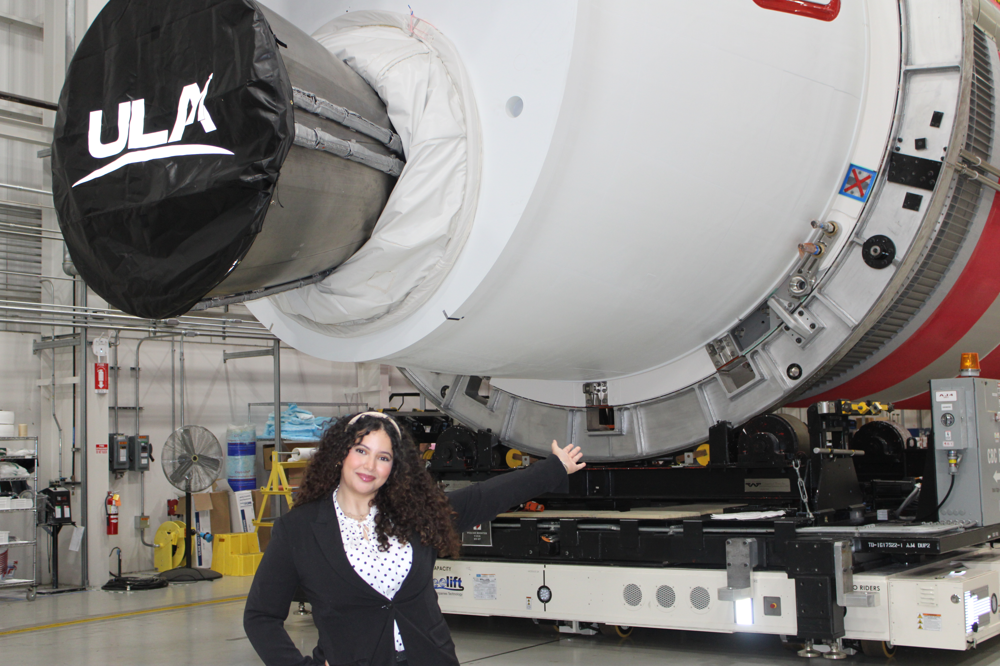
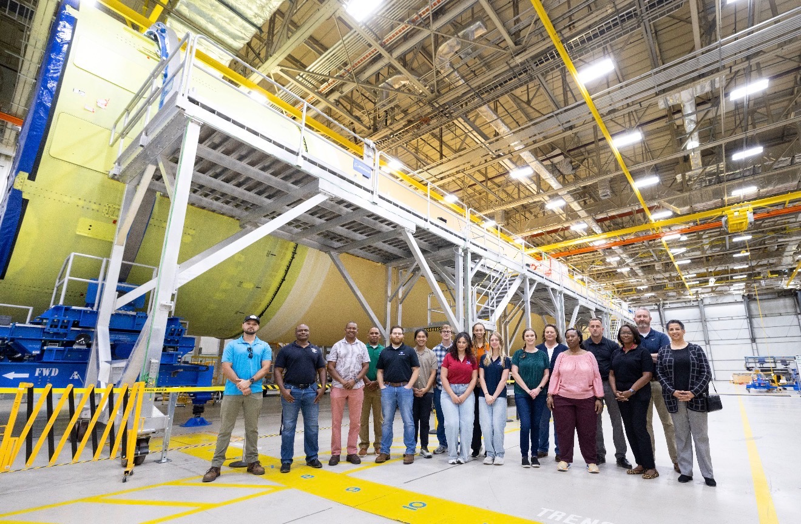

## Work Experience

::: {.wrap-container}
{.wrap-image} 

### United Launch Alliance

**Transportation Engineering and Logistics Intern:** Summer 2026\
:::

* Designing and prototyping a quad-cutter protective lid assembly for a new quad-cutter design.
* Developing a Ground Support Equipment (GSE) tracking checklist for Vulcan hardware to improve accountability
and asset visibility.
* Creating Power BI dashboards and an automated shipping calendar to streamline logistics planning and shipment
tracking.
* Supporting transportation and handling operations for Vulcan/Atlas launch vehicle components and associated
support equipment.

::: {.wrap-container}
{.wrap-image} 

### NASA Stennis

**Mechanical Design and Analysis Intern:** Spring 2026\
:::

*  Supported propulsion and engine test operations through the design and analysis of mechanical and piping systems
for cryogenic infrastructure.

*  Performed structural analysis for an $8M infrastructure project, developing solutions to protect instrumentation from
loads up to 40,000 lbf.

* Developed and organized product structures for test stand systems, improving model accessibility and engineering
efficiency

### Innovative Combustion Technologies

**Data Analysis Intern:** Spring 2026\

* Designed and analyzed combustion-related components to improve power system efficiency.
* Assisted in developing tools to predict SO₃ formation and support operational decision-making.
* Prepared technical documentation and reports for engineering reviews and research activities.

## Extracurriculars 

### University of Alabama Compact Muon Solenoid Group
**Research Assistant:** Aug 2026 - Present\

### Controls and Autonomy Lab
**Research Assistant:** Aug 2026 - Present\

### Fuels and Combustion Lab

**Research Assistant:** Aug 2025 - May 2026\

* Conducted research on aircraft contrail formation and atmospheric impacts, analyzing factors affecting condensation.
* Assisted in the design and development of a laboratory prototype to generate and study contrails under controlled
conditions for experimental testing.

### Formula SAE

**Tractive System Lead:** Aug 2024 - March 2026\

* Helped launch the team's first-ever electric vehicle entry, taking on the challenge of starting from zero with no prior
EV system in place.
*  Integrated BMS and shutdown circuit, including precharge, contactors, IMD, and TSAL per FSAE rules.
